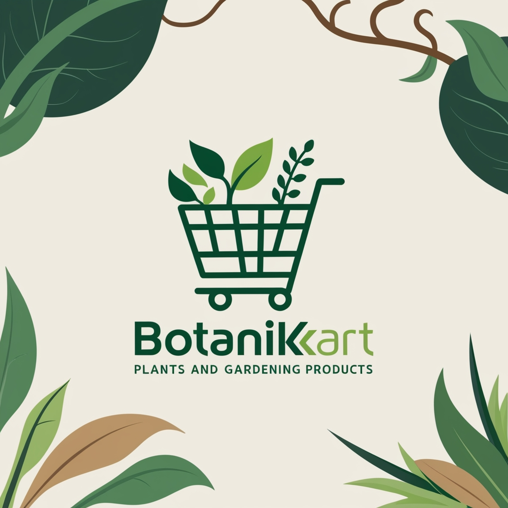
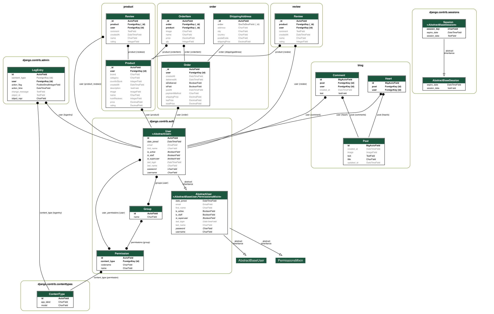

# BotaniKart

## Welcome to BotaniKart

BotaniKart is your one-stop shop for all things botanical. From seeds to fully grown plants, we have everything you need to create your own green paradise.

### Features
- Wide variety of plants
- Gardening tools and accessories
- Expert advice and tips

## Backend Models Overview

Here is the general graph for all the models in the BotaniKart backend:



This graph includes all the models for the various apps, such as `user`, `product`, `order`, `review`, `blog`, etc.

### Features of the Backend

- **User**: Manages user data and authentication.
- **Product**: Handles product listings, categories, and attributes.
- **Order**: Manages customer orders and payment details.
- **Review**: Allows users to leave product reviews.
- **Blog**: Contains blog posts, comments, and likes.

### Get Started

# BotaniKart Deployment Guide 🌱

## Get Started

Deploy and run the **BotaniKart** project locally using this step-by-step guide. Follow the instructions carefully for both backend and frontend setup.

---

## Prerequisites

Before starting, ensure you have these installed:

- 🐍 **Python 3.8+** (for Django backend)
- ⚛️ **Node.js 16+** (for React frontend)
- 📦 **pip** (Python package manager)
- 📦 **npm** (Node package manager)

---

## Backend Setup (Django)

### 1. Clone Repository
```bash
git clone https://github.com/abdelouahedakharaze/BotaniKart.git
cd BotaniKart
```

### 2. Navigate to Backend
```bash
cd BotaniKart_backend
```

### 3. Virtual Environment Setup
```bash
python3 -m venv venv
```

Activate Environment:

```bash
source venv/bin/activate  # Linux/MacOS
# venv\Scripts\activate  # Windows (PowerShell)
```

### 4. Install Dependencies
```bash
pip install -r requirements.txt
```

### 5. Database Migrations
```bash
python manage.py migrate
```

### 6. Run Development Server
```bash
python manage.py runserver
```

🌐 Backend Running at: http://127.0.0.1:8000

---

## Frontend Setup (React + Vite)

### 1. Navigate to Frontend
```bash
cd BotaniKart_frontend
```

### 2. Install Dependencies
```bash
npm install --legacy-peer-deps  # Resolves React 18 compatibility
```

### 3. Start Development Server
```bash
npm run dev
```

🌐 Frontend Running at: http://localhost:5173

---

## Connecting Frontend & Backend 🔗

Ensure both servers are running simultaneously.

Configure API endpoints in frontend to point to:
```javascript
http://127.0.0.1:8000/api/
```

Handle CORS if needed (should be pre-configured in Django settings).

---

Tip 💡

- Use separate terminal windows for backend and frontend.
- Check the console for errors if connections fail.
- API documentation is available at http://127.0.0.1:8000/swagger/

Happy Planting! 🌿


## Demo Videos

### 1. Registering and Logging In  
<video width="720" controls>
  <source src="docs/assets/registerlogin.mp4" type="video/mp4">
  Your browser does not support the video tag.
</video>

---

### 2. Searching for Products  
<video width="720" controls>
  <source src="docs/assets/search.mp4" type="video/mp4">
  Your browser does not support the video tag.
</video>

---

### 3. Reading Blog Articles  
<video width="720" controls>
  <source src="docs/assets/blogreading.mp4" type="video/mp4">
  Your browser does not support the video tag.
</video>

---

### 4. Exploring a Product Page  
<video width="720" controls>
  <source src="docs/assets/product.mp4" type="video/mp4">
  Your browser does not support the video tag.
</video>

---

### 5. Managing Your Profile  
<video width="720" controls>
  <source src="docs/assets/profile.mp4" type="video/mp4">
  Your browser does not support the video tag.
</video>

## To-Do  

- [ ] Integrate PayPal payment gateway  
- [ ] Integrate Stripe payment gateway  
- [ ] Enhance search functionality to include:  
  - [ ] Blog articles  
  - [ ] Generalized search across all content